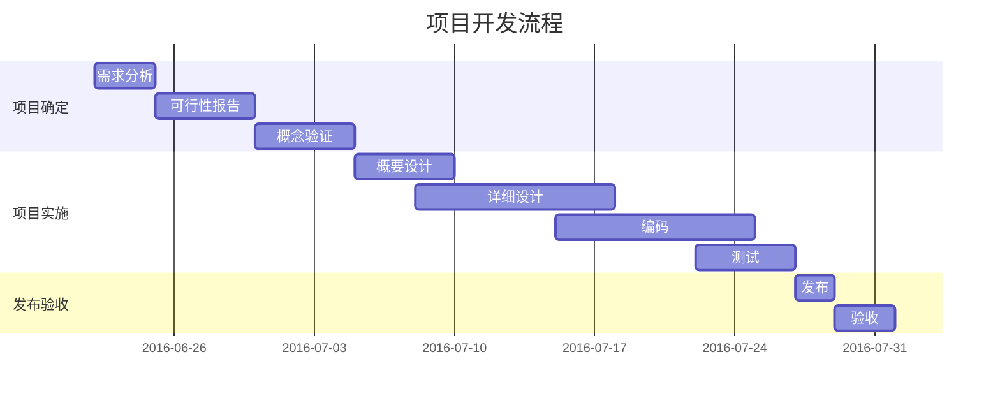

## none diwb 

this is a software
## this is title 1

### this is title 2

this is 

​	大

​	

​	

this is a 

sgfds 

```flow
st=>start: Start
op=>operation: Your Operation
cond=>condition: Yes or No?
e=>end

st->op->cond
cond(yes)->e
cond(no)->op
```


```sequence
Alice->Bob: Hello Bob, how are you?
Note right of Bob: Bob thinks
Bob-->Alice: I am good thanks!
```

hahaa 

​    这里  有个    空壳




this 


$\sum_{i=0}^n i^2 = \frac{(n^2+n)(2n+1)}{6}$

$$\begin{align}
\sqrt{37} & = \sqrt{\frac{73^2-1}{12^2}} \\
 & = \sqrt{\frac{73^2}{12^2}\cdot\frac{73^2-1}{73^2}} \\ 
 & = \sqrt{\frac{73^2}{12^2}}\sqrt{\frac{73^2-1}{73^2}} \\
 & = \frac{73}{12}\sqrt{1 - \frac{1}{73^2}} \\ 
 & \approx \frac{73}{12}\left(1 - \frac{1}{2\cdot73^2}\right)
\end{align}$$


- [ ] 支持以 PDF 格式导出文稿
- [ ] 改进 Cmd 渲染算法，使用局部渲染技术提高渲染效率
- [x] 新增 Todo 列表功能
- [x] 修复 LaTex 公式渲染问题
- [x] 新增 LaTex 公式编号功能


$$
\begin{cases}
a_1x+b_1y+c_1z=d_1\\
a_2x+b_2y+c_2z=d_2\\
a_3x+b_3y+c_3z=d_3\\


\end{cases}
$$

shtis 

　　这个是一个篇$P=\frac {{U}^{2}} {R}$短文一


文一个篇短文一个篇短文一个篇短$\begin{cases}a_1x+b_1y+c_1z=d_1\\a_2x+b_2y+c_2z=d_2\\a_3x+b_3y+c_3z=d_3\\\end{cases} $文一个篇短文一个篇短文一个篇短文一个篇短文一个篇短文


```python
#!/usr/bin/python3		
print("Hello, World!");
```
thisis a  

```c
main(){
	int i;
	int j;
  
}
int zhidao() {
	int i;
  	int j;
}

```

| vp2    | von3 | vol12   |
| ------ | ---- | ------- |
|        |      |         |
| gfsg   | fds  | fds     |
| fdsfds | ffs  | sgfs    |
| fsgfds | fs   | fdsgfds |
|        |      |         |


```bash
#!/bin/sh
PRODUCT_NAME="bcproduceowapi"
APP_NAME="bcproduceowapi"
rm -rf output
mkdir -p output/app/$APP_NAME
mkdir -p output/conf/app
mkdir -p output/webroot/$APP_NAME
mkdir -p output/php/phplib/$PRODUCT_NAME/api/$APP_NAME
cp -r actions controllers library models script Bootstrap.php output/app/$APP_NAME
cp -r conf/*  output/conf/app
cp -r index.php  output/webroot/$APP_NAME
cp -r api/* output/php/phplib/$PRODUCT_NAME/api/$APP_NAME
cd output
find ./ -name .svn -exec rm -rf {} \;
tar cvzf bcproduceowapi.tar.gz app conf webroot php
rm -rf app conf webroot php
```

   


    thz
    代码快
    hiss


    dafda
    fdafd


    das
    dfas
    
    das
    dsa
    
    dsafdsa
    dsafdsa

[md文件 ](./test333.md "baidu")

这个是一个篇短文一个篇短文一个篇短文一个篇短文一个篇文一个篇短文一个篇短文一个篇文一个篇短文一个篇短文一个篇文一个篇短文一个篇短文一个篇文一个篇短文一个篇短文一个篇文一个篇短文一个篇短文一个篇文一个篇短文一个篇短文一个篇短文一个篇短文一个篇短文一个篇短文一个篇短文


```c
main{
	int i;
	int j;
}
```

### this s php 代码

```php
<?php

$obj = new obj();
$obj->run();

class obj{
    /**
        this is a comment 
    */
    public function __construct() {


    }

    public function run() {

    }


}

```


    ds
    fdsafdsa

this is ha


    dasfda
    fdafdas


this is s a 

```
    gds
    fdafdsa
    fds
```


[baidu](http://www.baidu.com "baidu")


feaf

一个篇短文一个篇短文一个篇短文一个篇短文一个篇短文一个篇短文一个篇短文一个篇短文一个篇短文一个篇短文


#### HTML 代码 HTML codes
```html
<!DOCTYPE html>
<html>
    <head>
        <mate charest="utf-8" />
        <meta name="keywords" content="Editor.md, Markdown, Editor" />
        <title>Hello world!</title>
        <style type="text/css">
            body{font-size:14px;color:#444;font-family: "Microsoft Yahei", Tahoma, "Hiragino Sans GB", Arial;background:#fff;}
            ul{list-style: none;}
            img{border:none;vertical-align: middle;}
        </style>
    </head>
    <body>
        <h1 class="text-xxl">Hello world!</h1>
        <p class="text-green">Plain text</p>
    </body>
</html>
```

